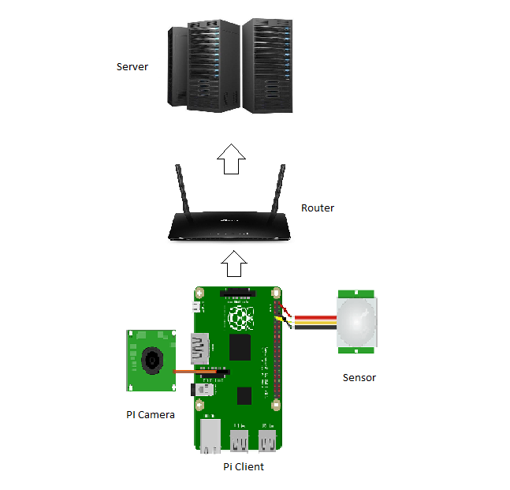

# picast

> A lightweight fast data streaming library for raspberry pi in python.

For images, TCP protocol is used, and for sensor data / other parameters UDP is used.

## Instructions

1. **monitor no signal issues** https://howtoraspberrypi.com/raspberry-pi-hdmi-not-working/
2. **VNC** https://www.raspberrypi.org/documentation/remote-access/vnc/README.md
3. **install opencv** https://linuxize.com/post/how-to-install-opencv-on-raspberry-pi/#disqus_thread
4. `sudo apt-get install python-opencv` # (old, python2)
5. `sudo apt-get install libopencv-dev python3-opencv` # (python3)
6. **install ffmpeg** https://www.tecmint.com/install-ffmpeg-in-linux/
7. **install vidgear** https://github.com/abhiTronix/vidgear
8. **install PySimpleGUI** `pip install PySimpleGUI` (PC server)


## Video Demo



https://www.youtube.com/watch?v=OHKOXVxlTFc


## Server Side (PC/Pi/...)

```
from picast import server
import cv2

my_server = server(ip = '192.168.10.50', port_1 = 10000, port_2 = 5454)

while True:
	a, b, c = my_server.receive_data()
	# data
	print(b)
	# address
	print(c)

	cv2.imshow("Picast Demo", a) # image

	key = cv2.waitKey(1) & 0xFF
	# check for 'q' key-press
	if key == ord("q"):
		#if 'q' key-pressed break out
		break

cv2.destroyAllWindows()

```

## Server Side (PC/Pi/...) with GUI

```
gui_test.py
```

## PiClient Side (Raspberry PI)

```
from picast import piclient
import random

my_client = piclient(ip = '192.168.10.50', port_1 = 10000, port_2 = 5454, time_delay = 1, frame_rate = 25, img_resolution = (320, 240))

print('piclient initiated')
sensor_val = 1
while True:
    my_client.send_data(json_data = {'sensor_val': sensor_val})
    sensor_val = (random.randint(0,500))
```


